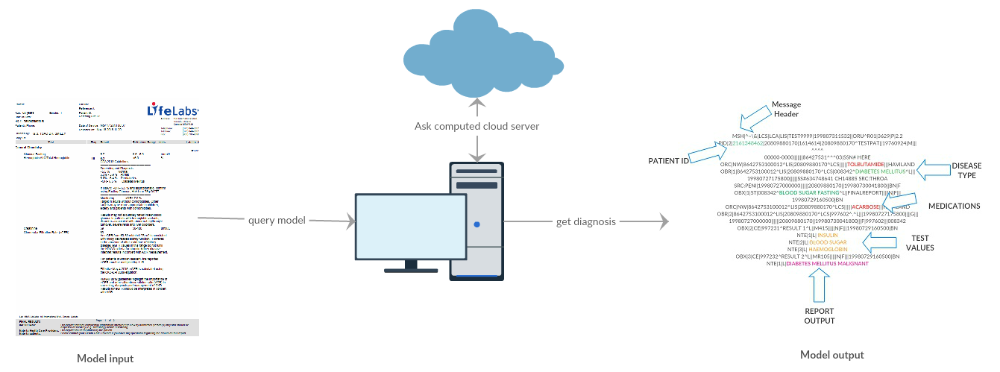

# Privacy preserving distributed neural network

  
  
Dependencies :  
PySyft  
PyTorch  
Numpy  
Pandas  
Sklearn  

The dataset used is the Pima Indian Diabetes dataset with 8 features and 768 rows and a target column. 

The Single Hidden Layer python notebook is the one without virtual model.

The FLModel single layer is the one with two virtual nodes called Bob and Alice working with 50% of the training data. The average aggregation is done in a secure worker node called "secure worker". All virtual connections are developed using PySyft (open source on Github) 
 